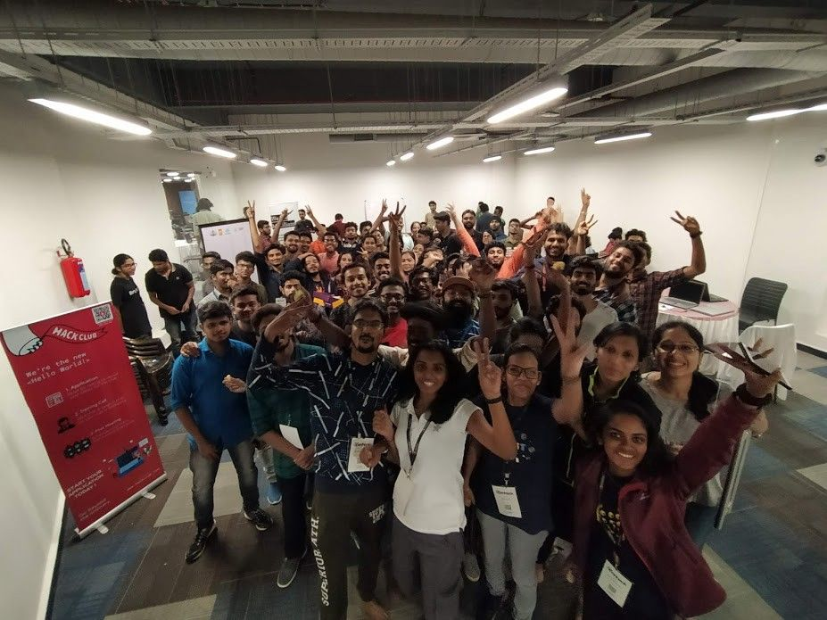
_OpenHack2019 Team_

A Blog Post about OpenHack 2019 👨‍💻 - 48hrs Collaborative hackathon Summary

{/* truncate */}

# Introduction

So what is [OpenHack](https://openhack.tech/) , it’s an immersive open hackathon where students, professionals, researchers, makers and anyone with an interest in technology gather together to build a single project, disaster management, awareness and alertness platform in two days. I’ve been part of the hackathon as IoT/Hardware mentor with [makergram community](https://community.makergram.com/).

OpenHack is very different from normal hackathon, in normal hackathon, it’s all about competition and everyone building a different solution, but here every single one working on the same problem and the same solution collaboratively. 🥰

> After every storm the sun will smile; for every problem there is a solution, and the soul’s indefeasible duty is to be of good cheer. — William R.

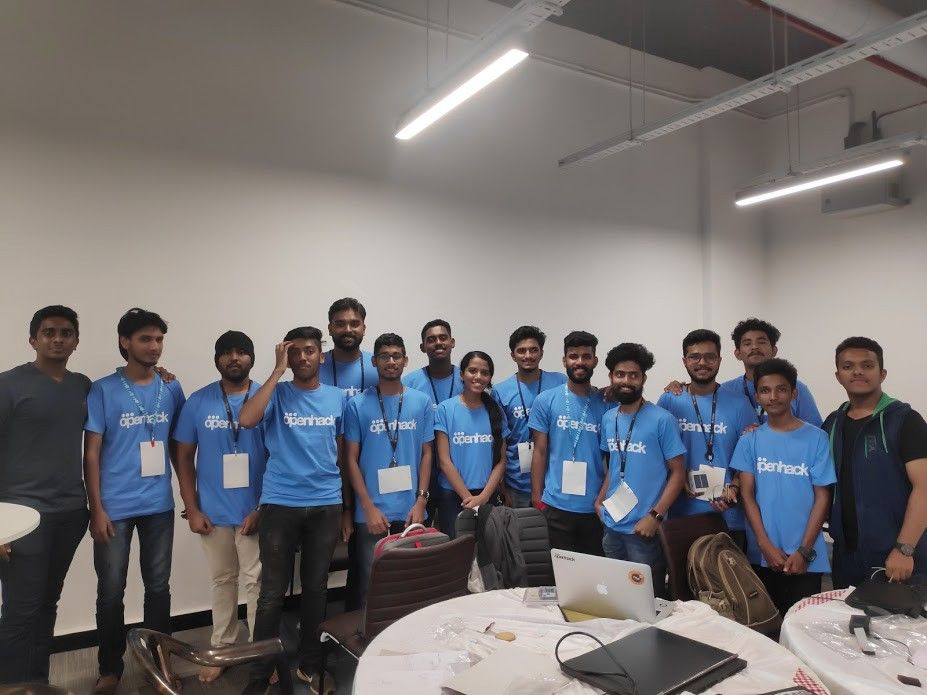
_IoT Team_

> Various states in India has been struggling due to natural calamities, taking away from us our brothers and sisters and forcing the rest out of their day to day life and to the relief camps with no adequate food, clothing and shelter. This is something that happens every year on a global scale.

> As educated youth we simply can’t stand on the borders of safety and watch the world burn. We decided to help by doing what we do best- Code! OpenHack aims to build a Free Platform that can be used by governments and communities who are suffering from natural calamities to organize coordinate relief activities. So this is an open call all technologists, enthusiasts, students, makers and hobbyists to come together to rebuild EARTH. At OpenHack we will only be developing a single project, with Web and Mobile Clients.

## Objective

OpenHackthon is mainly focused on Software Solution for the first time but later extended to hardware too because hardware prototype needs hardware component we can’t import/download from the web also good mentorship too, each decision is important.

we had a poll in our Openhack participant’s group regarding the tech stack.

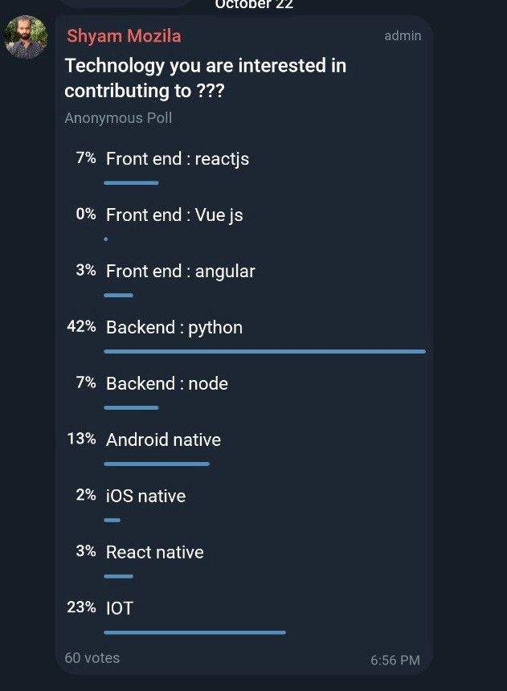

surprisingly we had 23% of people interest from in IoT 🤘, and after that Shyam gave a brief about the hackathon.

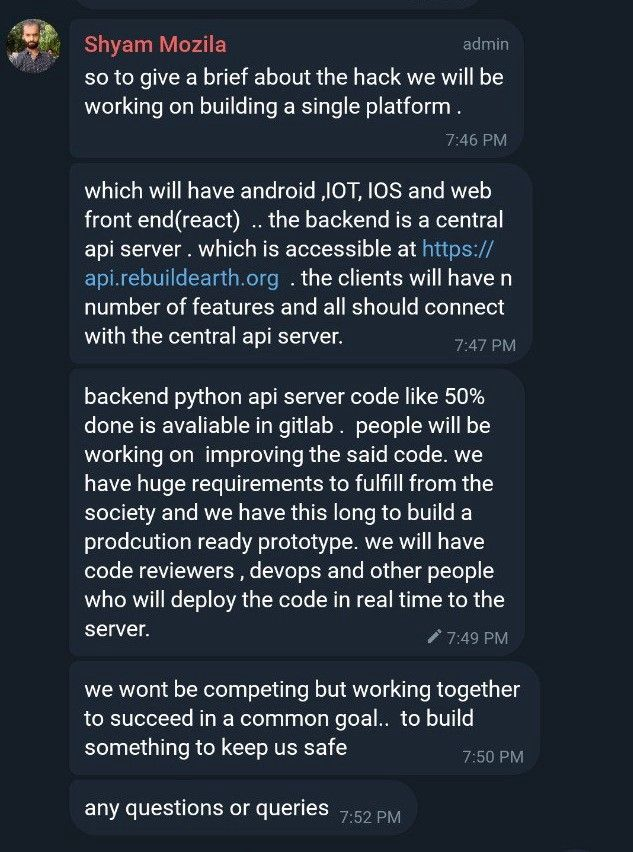

## IoT Team

I was one of the mentor for the **IoT team**, the main goal to keep every on the same page and build a feasible solution using IoT technologies and important thing is documentation, so we can’t complete it someone can use the docs and complete it.

The hack begins: due to some problem, I couldn't attend Innaguaration ceremony, Inauguration and Keynote Dr Chitra S and our KSUM CEO Dr Saji Sir, IT Secretary Sivasankar sir etc.

after the inauguration the hackathon started , I gave some time to my teammates to know each other 😅 (I was late)

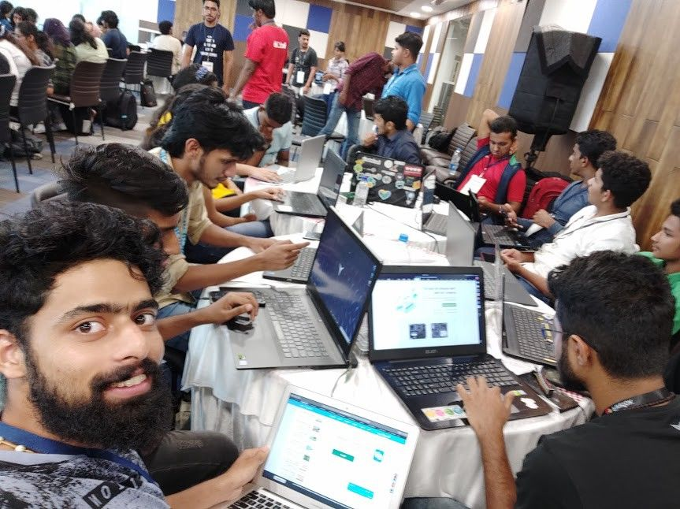

we started with writing down the problem statement ( we didn’t get any specific problem statement), so we listed some problems and divided into three categories: Before the flood, During the Flood, After the flood.

After team discussion and searching on the internet we found that predicting the flood will help reduce the emergencies and help people to evacuate quickly , so we focused on the Before the flood situation and we found that the only requirement is lacking enough data to predict the flood after discussion with back-end team, they also build the prediction solution but lack of data they didn’t continue .

## BrainStorming

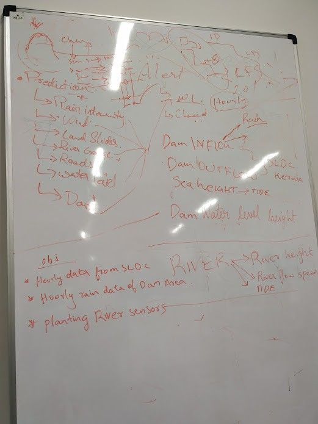

After discussion the Backend team, they listed some sensor parameters that required to do the prediction . and they also need data from two different sources one is Dam and another one is a river.

Dam data is already available from Kerala SLDC so we don’t need to build any hardware to measure that , but there are two problems one the frequency and amount of data collection is not enough to predict another one is getting large amount data we need to go through some long-term procedure, so we planned to contact the SLDC team regarding that we can move further .

Live river data is not available anywhere , meanwhile Dam data is on pause we can build the river sensor nodes that can collect real-time data and send back to the prediction team . backend prediction team gave some sensor parameters they need to do the prediction , the parameters are River Water level, Water Flow Speed, Rain Gauge ..etc .

So now we got the exact problem statement and what we need to do, that is to collect the data requested by the backend team to predict the flood due to river overflow .next we need to find the sensor’s to read the parameters and establish a feasible communication between the sensor to send the data.

## Design prototype

Our team listed many sensors and methods to grab the data that we required, unfortunately, it’s a hackathon and we need to complete the MVP on tomorrow evening, most of the requested sensors are not available in our personal inventory so we decided to go with what we have and implement our own sensors and measuring methods .

For the River Water level data we have two options one is Accelerometer inside an enclosed ball and based on the acceleration data measure the water level and another one is using Ultrasonic sensor to keep monitor water level by measuring the water surface distance . after discussion with our team and some of the friends we decided to go with the ultrasonic sensor , and yes we have the HCSR04 Ultrasonic model , it’s not the best one it will do the job .

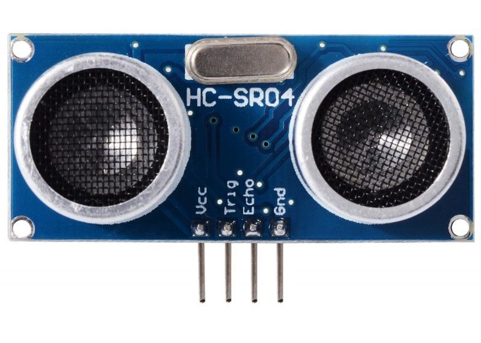

## Prototyping

For the Water Flow Speed we looked into the internet, we found many but due to availability we can’t use that so one of the members suggested to use DC motor with propeller set up and read the voltage that is proportional to the flow rate also two of the guys says they will take care of the Water Flow sensor building (happy moment )

For the Rain Gauge, one of member hey guy’sRafi got the sensor module to measure the rain intensity but that’s not an accurate rain gauge but we something is better than nothing so we are planning to go with the sensor Rafi have.

## Network

Next Network , as we know before flood everything good no issues with network (cellular) no power outage issues, so we discussed available network systems like wifi, gsm, SigFox, LoRa ..etc and luckily we have some of the modules also with us , we have 2 LoRa , GSM\NB-IoT , WiFI dev kits (NodeMCU based on popular esp8266) . so quick and easiest build platform NodeMCU because it’s based on Arduino, many members are worked with that before , but the problem with NodeMCU is it based on wifi and we are going to install at the river shore, yeah we don’t have wifi access point on the riverside or we need to install a wifi modem in the riverside so just skipped the wifi (will back into this) . another thing we can use is LoRa WAN, LoRa is Powerful network and built specifically for the Connected things that work on low energy and low power, but LoRa wan need a gateway to communicate with server , unfortunately we don’t have a gateway but we planned to do one Lora as node and another module act as gateway to the server . another good thing none of them we worked with LoRa or didn’t get a chance to work with that, so this is the time.

## Server

Server connection, now we figure it out what data we need and which sensor we need to use and how what network we are using, we need to give the data to the backend team, they need the data to be a JSON structure , and they asked us to make an API to access the data . so instead of sending data directly to the server we are sending to the server via API so anyone in the public can use that data via another API, that makes sense, everyone can get the information. So since none of them didn’t have a server we plan to go with firebase, one of our member Alex Jolly shows interest to set up the firebase, he will structure the data and the database and provide an API to the backend team. Great!

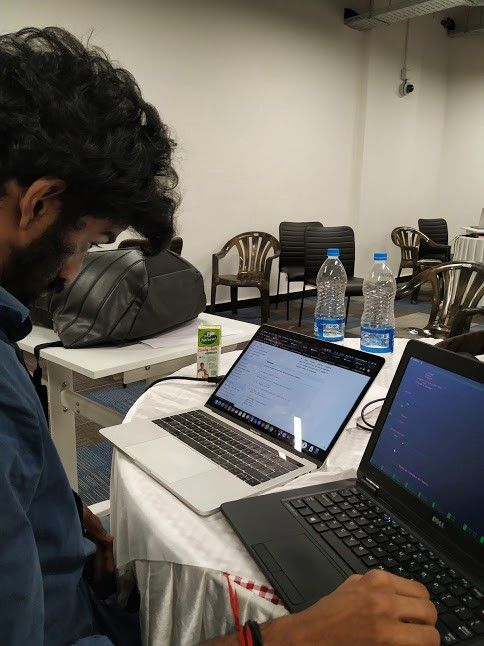

## Team Split

Team division, we divided the team into different parts based on what they are working, one team working on Water Flow sensor, they building own water flow meter, one team focused on LoRa implementation and the funny part is everyone’s interest to be part of Lora since everyone wants to learn LoRa. another team worked on nodemcu implementation as a backup (yeah we had a backup plan), we planned to use cellular but didn’t try due to time limitation .another team worked on documentation they also part of the Lora team too.

FireBase team was successfully mocked the data using a python script, but they stuck to get data to the backend team . meanwhile with support my friend GKR ( Gautham Krishna r) I was trying to build an API using NodeJS and Express, we used MongoDB but due to small server config the MongoDB is crashed, I used digital ocean $5 Linux Droplet, but it was a great learning for me. Big thanks to GKR.

After the hard work of the firebase team, we successfully passed the data to the backend team via API (we called Alex errorless API).

## LoRa

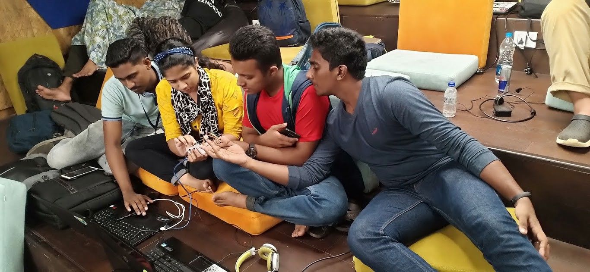
_LoRa Team is looking for Bug 🐛_

In Lora, due some issues we can’t establish the communication between two nodes , but it was a great learning for the team, In the first, team spend hours to find out the error and they successfully debugged the Lora receiver part, but we stuck at sending part, we ‘ll find out and document it later.

As you know we had a backup with NodeMCU, we successful published the Ultrasonic data to firebase via wifi then we got an enclosure from my inventory, that comes with the RAK5010 Cellular Module, the good thing about the enclosure is fully waterproof and comes with a small solar panel.

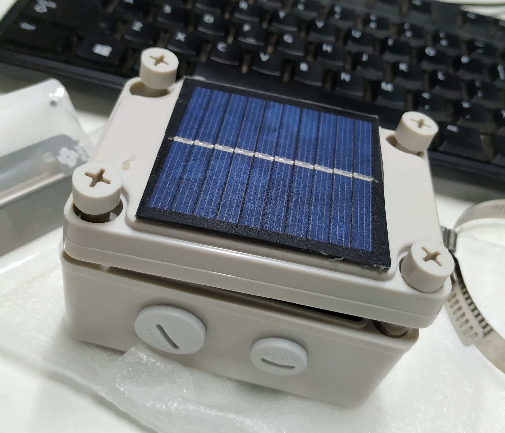

At the End: we used the Adafruit ESP8266 Feather board, which I got from hackster as a gift. it has an inbuilt LipO charging circuit so we can directly plug into that LipO battery that comes with RAK5010.

we sucessly full send data to the cloud from the sensor to firebase, from the firebase using API backend team will get the data for predicting

## Conclusion

Our solution’s not the best, but we will keep working to make it feasible. we are refracting and documenting our code, please keep an eye on our Github repo: [github.com/RiverMonitoringSystem](https://github.com/RiverMonitoringSystem)

if you want to contribute the solution to please check out [gitlab.com/rebuildearth](https://gitlab.com/rebuildearth)

## Some Awesome Moments

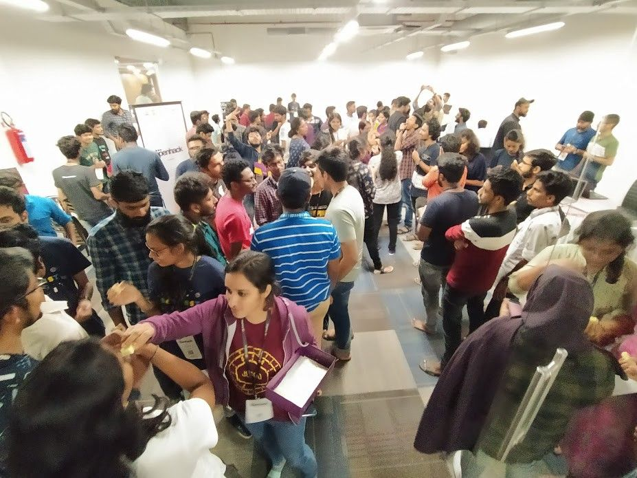
_Midnight Diwali celebration_

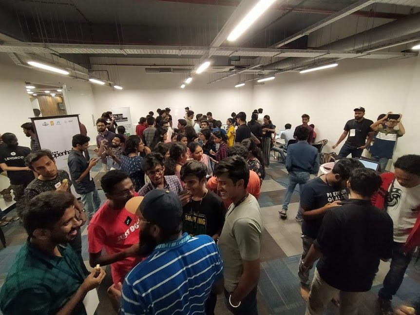

_Midnight madness 💃_

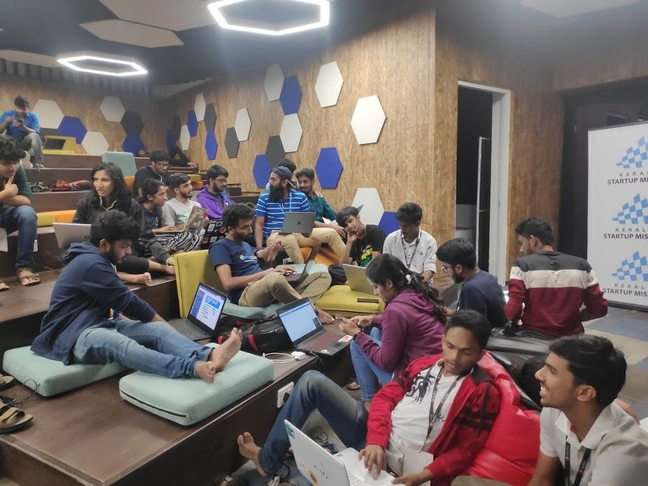
_long discussions 🗣_

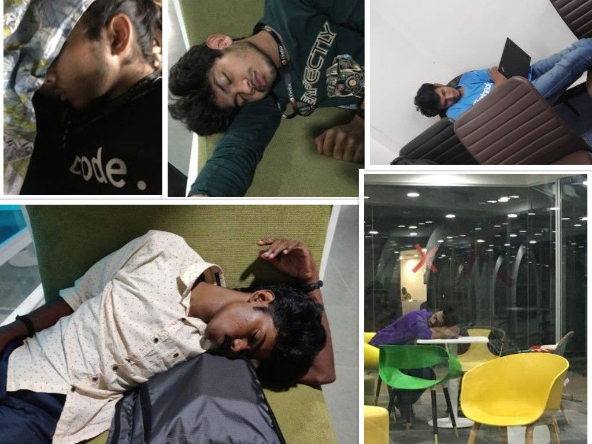
_sleeping is our superpower 🤫_

meanwhile, we introduced MakerFaire Hyderbad to our fellow participants with super awesome MFHYD Students lead Anlee and Rafi

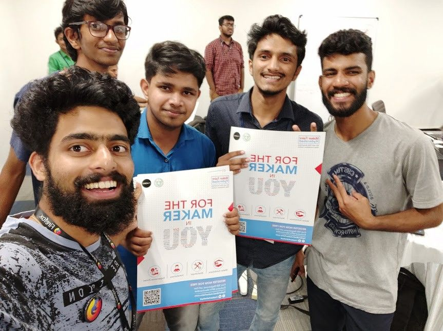
_sleeping is our superpower 🤫_

Big Thanks to all the people who support us, It was truly AWESOME 🥰.

### Update

**24/10/2019** : We are still working on the solution and currently try to build a stable hardware , you can find the meeting log here: https://community.makergram.com/topic/65/openhack-open-river-monitoring-system-for-flood-prediction