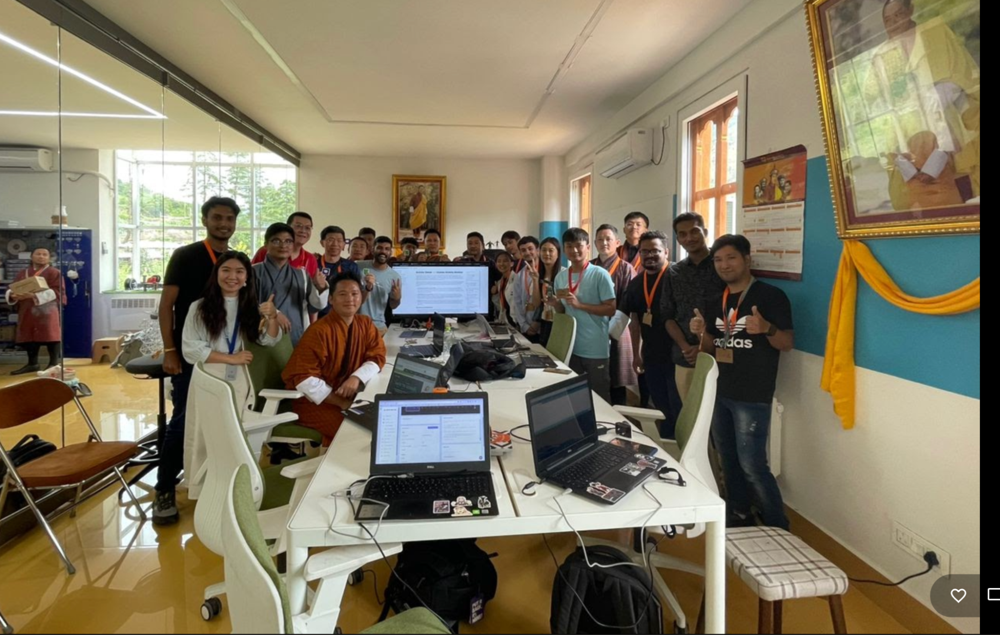
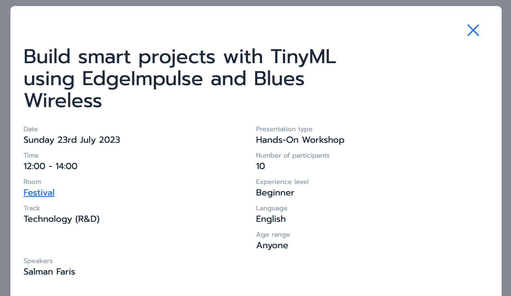
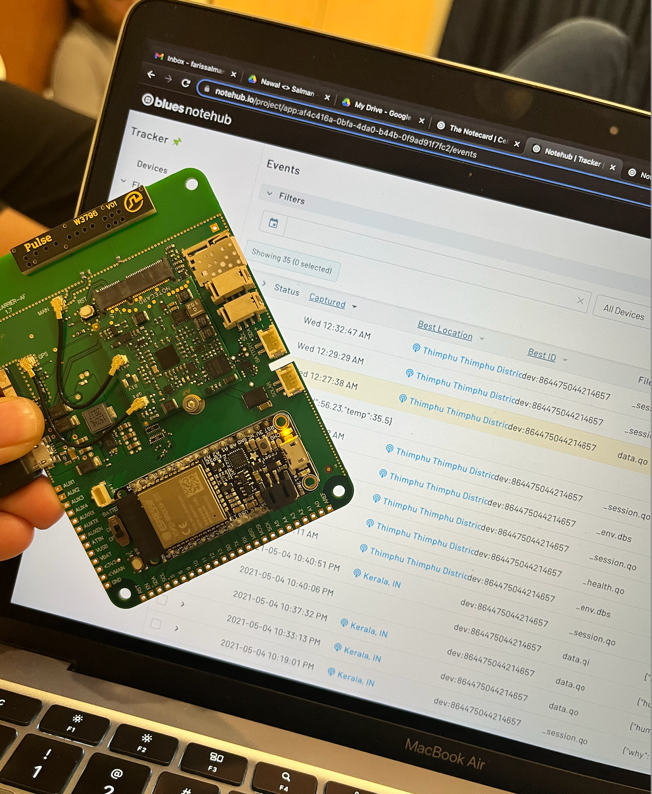
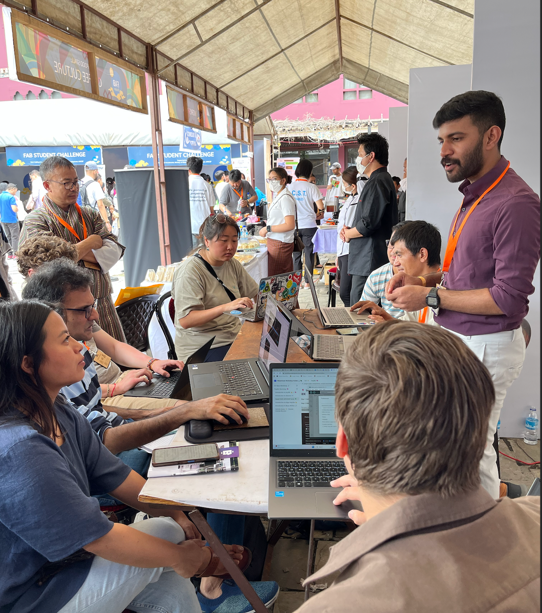
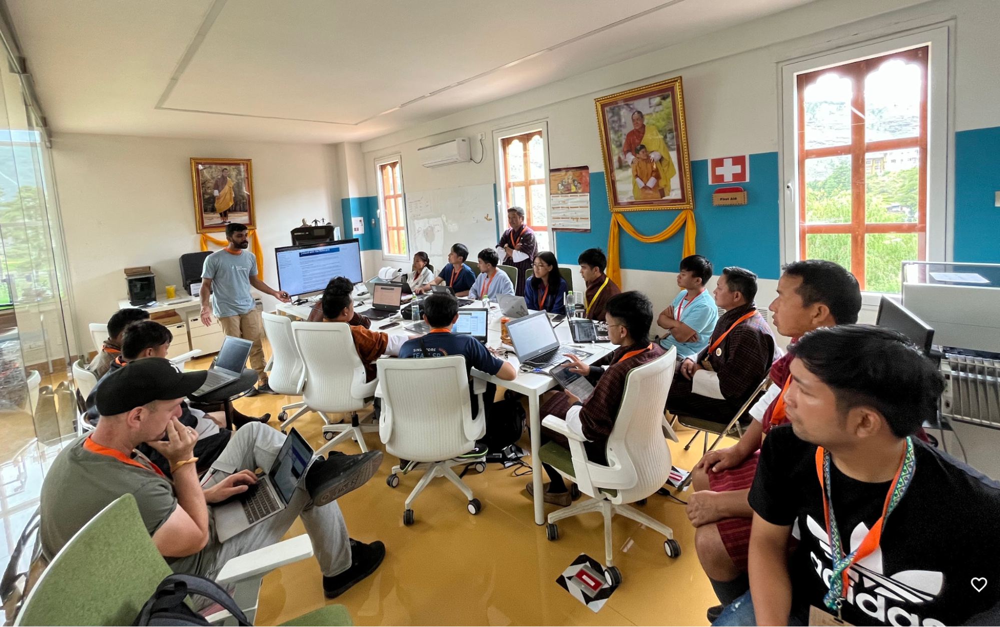

With support from Blues.io, I delivered a workshop at the Fab23 conference in Bhutan, showcasing the power of TinyML using Blues, even in remote locations.

_TinyML Workshop at Fab23 Bhutan_

{/* truncate */}

First, I'd like to thank the Blues.io team 🤗. With their support. I was able to take part in the Fab23 international conference.

FAB23 Bhutan is the 19th edition of the largest global digital fabrication event. This event connects makers, inventors, academics, and entrepreneurs with a shared goal. This goal is to co-create pathways for our shared future using technology as a platform.

During the conference, the Makergram community and I conducted a workshop. The workshop titled “Build smart projects with TinyML using Edge Impulse and Blues Wireless” showcased the power of machine learning on microcontrollers. With the Blues wireless offering, participates could speed up their journey from idea to product.

Upon my arrival in Bhutan, I assessed cellular connectivity using the Notecard in tandem with the Notecarrier-F board, while utilizing B-mobile. B-mobile is the pioneering mobile communications service introduced by Bhutan Telecom in 2003.

I confirmed I was able to connect, and I sent data to Notehub without any issues. Luckily, B-Mobile has coverage in the majority of Bhutan. I even had B-Mobile connection while hiking to Bhutan's largest Bhudh temple and to tiger nest.

After completing the coverage test, I worked on the workshop materials. You can access the guides prepared for this [workshop here](https://workshop.makergram.com/docs/category/tinyml-workshop).

During the workshop, we built a project called “*Activity Sense ✨ - Human Activity Monitor*”. SeeedStudio graciously sponsored the XIAO nRF52840 modules essential for the workshop. With these modules, we were able to execute tinyML inferences on the XIAO platform. We also transmitted the results to the cloud using the blues.io WiFi notecard.

I documented all the workshop steps on [MakerGram](https://workshop.makergram.com/docs/tiny-ml-workshop/ActivitySense), so anyone can follow and complete it if they have the hardware.

The first workshop took place on day 1 of the Fab23 festival held in Thimpu, the capital of Bhutan.

We hosted 9 participates and several extra people visited during the worksop. We started with an introduction to Arduino, Edge impulse, Blues and Seeed XIAO nRF52840. Then we started work on the project.

Participants followed the steps I documented in MakerGram and worked at their own pace. I also worked through the project at the same time, so participants could follow along. It was an awesome experience interacting with participants from all over the world and introducing them to tinyML and Blues.

I interacted with a variety of people from students, faculty, and industry experts.

Aside from conducting the workshop, I was able to enjoy some free time. I got a chance to hike to Paro Taktsang and Taktsang Palphug Monastery. I also hiked to the Tiger's Nest with my friends. I was able to observe that the majority of Bhutan has high cellular coverage. Even on the top of the Paro Taktsang, we received cellular coverage and the network speed was good.

Due to a request, I gave one more session on tinyML at the end of the conference day, and it went very well.

In the end, we got very positive feedback from the participants 🤗, Thanks to my friends and mentors Adrian (Fab Foundation) ,Eric (SeeedStudio),Jinger (hackster),Jogin(Fablab kerala),Mufeed(Fablab kerala),Praveen(Fablab kerala),Saheen(NASSCOM),Shibu(Fab Foundation),Sibin(Fablab kerala), Swalah(Makergram) and Violet(SeeedStudio) for all the support throughout the event and journey. A big shout-out to Blues and their Amplifier program 🚀.

Originally Published at Blues.io blog https://dev.blues.io/blog/blues-at-fab23-bhutan/

