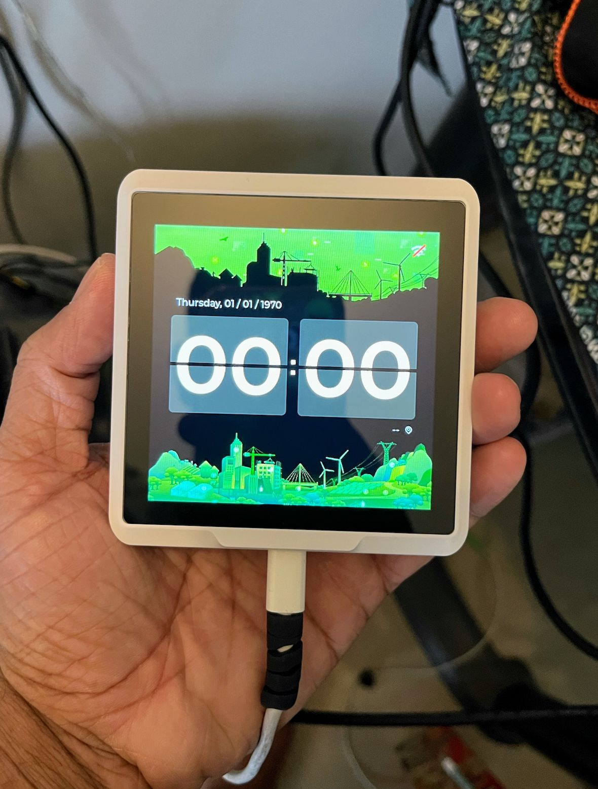
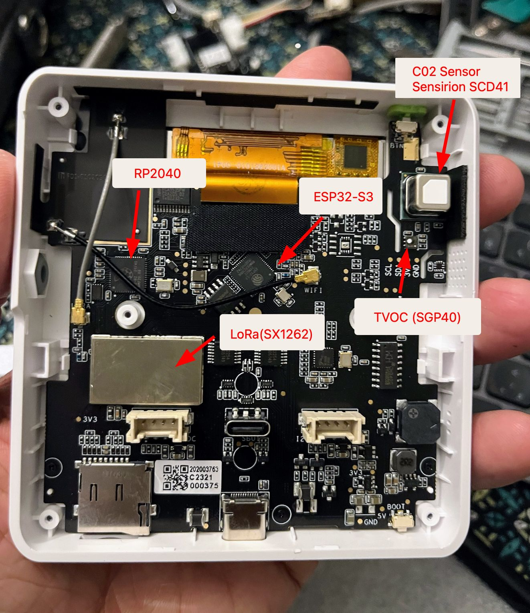

Review 📖 : Recently, I got a chance to work with Seeed Studio SenseCAP Indicator D1Pro - A 4-inch Touch Screen IoT development platform powered by ESP32S3 & RP2040.

_SenseCAP Indicator D1Pro_

{/* truncate */}

The board comes with Type-C and Grove interfaces, supports ADC and IIC transmission protocols, and can easily connect to other peripherals with rich GPIOs.

🚀 Features
✨ Dual MCUs and Rich GPIOs: Equipped with powerful Espressif Systems ESP32S3 and Raspberry Pi RP2040 dual MCUs and over 400 Grove-compatible GPIOs for flexible expansion options.
✨ Real-time Air Quality Monitoring: Built-in tVOC and CO2 sensors, and an external Grove AHT20 temperature and humidity sensor for more precise
✨ Local LoRa Hub for IoT Connectivity: Integrated Semtech SX1262 LoRa chip (optional) for connecting LoRa devices to popular IoT platforms such as Matter via Wi-Fi, without the need for additional compatible devices.
✨ Fully Open Source Platform: Leverage the extensive ESP32 and Raspberry Pi open-source ecosystem for infinite application possibilities.

💡 If you are looking for a 4-inch Touch Screen based on to prototype project or product, SenseCAP Indicator D1Pro is worth considering. I'll experiment more and share my insights here. Stay tuned! 👋

_SenseCAP Indicator D1Pro Inside_

#prototyping #electronics

Original Posted on Linkedin: https://www.linkedin.com/posts/salmanfarisvp_prototyping-electronics-activity-7113445665308868608--xoe/