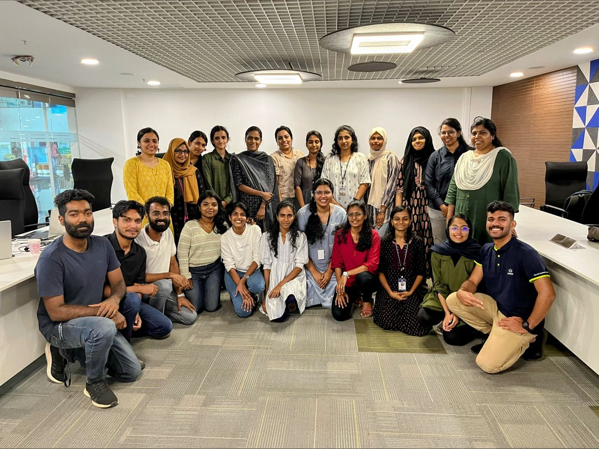
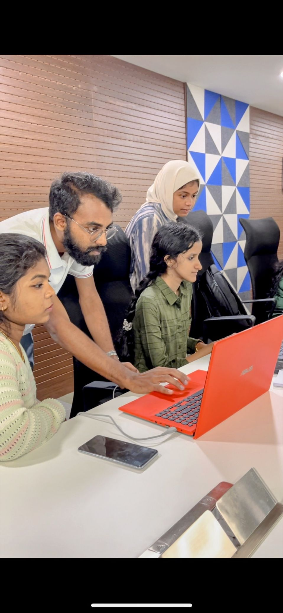
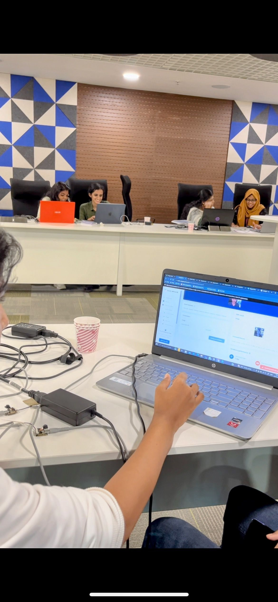

A Blog Post about FABHer 2023 TinyML Workshop for Women at Fablab Kerala Superlab.

{/* truncate */}

Originally posted on [Linkedin](https://www.linkedin.com/posts/salmanfarisvp_tinymlabrworkshopabrseries-fabher-women-activity-7111535608103141376-q8iM?utm_source=share&utm_medium=member_desktop)

As a precursor of Kerala Startup Mission Women summit 5.0 (the biggest gathering of women entrepreneurs) with Fablab Kerala , MakerGram and Seeed Studio We organised hashtag#FABHer: The Hands on workshop session exclusively for hashtag#women, on 23rd September 2023 at Integrated Startup Complex (ISC) Kochi.

The workshop was focused on how to build and implement Tiny Machine Learning (TinyML) using hashtag#XIAO ESP32S3 and Edge Impulse. Interestingly, the participants were from experienced ML practitioner, AI/ML startup founders, non-technical background and students who wants to explore the feild and we had great time learning each other 🙌.

We started the session by covering the fundamentals of ML and embedded systems to makesure everyone on same page and them started experimenting with tinyML with Seeed Studio SenseCraft tool and then arduino and finally made fully functional tinyML project from scratch.

Participants were able work on projects like, Glass breakage alert system 🪟, keyword spotting 🗣️, Classroom automation using computer vision, faucet monitoring system 💧, driver monitoring system, Smoking detection 🚬CCTV camera module anomaly detection and vehicle classification 🚚.

Overall it’s was interesting to intract women entrepreneurs , domain experts and students from various fields ✨.

At the end. we had visit to the Fablab Kerala Superlab 🙌.

Thanks to Kerala Startup Mission , Seeed Studio and Fablab Kerala for the opportunity and team MakerGram , amazing volunteers Muhammed Zain , Fasna C , sherhin shoukath ,Nawal Abdul Kareem , Saheen Palayi , jogin francis and operation team Sradha Suresh , Sheryas George, Anjana Joseph , Abhilash .