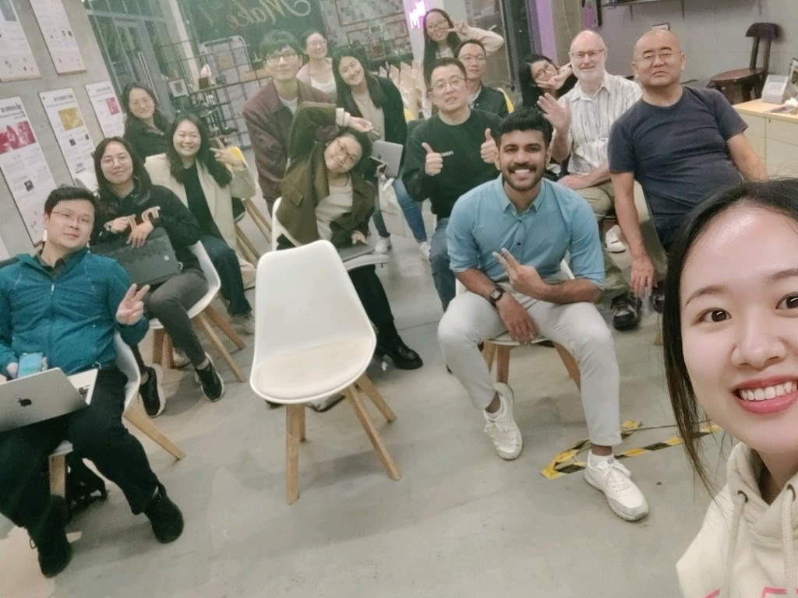

Hey 👋, October and November 2023 were packed with incredible community events, and I’m excited to share a few I was involved in! Let’s dive into a chronological rundown, starting from the first event. Here we go!

{/* truncate */}

Originally posted on - [SeeedStudio Blog](https://www.seeedstudio.com/blog/2023/12/29/tinyml-triumphs-a-chronicle-of-october-november-workshop-series-%E2%9C%A8/)

#TinyML_Workshop_Series 🚀

Hey 👋, October and November 2023 were packed with incredible community events, and I’m excited to share a few I was involved in! Let’s dive into a chronological rundown, starting from the first event. Here we go!

1. TinyML Hands-on Workshop at Robu.in – Pune, India – October 5th 2023

During the initial week of October, an incredible in-person workshop took place at Robu.in. Renowned as one of the largest e-commerce platforms for electronics, Robu offers an extensive range of Seeed components. Our workshop was meticulously designed to elevate the skills of Robu employees through a hands-on experience with the XIAO ESP32S3 Sense in a dedicated tinyML Workshop. It also served as an excellent opportunity to familiarize participants with other innovative XIAO and Seeed products.

Thanks to Athul, Anubhav Sharma, Omkar Sandbhor from Robu, Alison and Kingsley Li from the Seeed team for the support.

2. SenseCAP-T1000 Tracker and Datacake Integration Community Call By Accomdemy Community – October 9th 2023

During the Accomdemy MakerMonday online community meetup, I led a session titled “Introduction to Seeed Studio [SenseCAP-T1000 Tracker](https://www.seeedstudio.com/SenseCAP-Card-Tracker-T1000-A-p-5697.html?queryID=77ac3a65d15fcd88ebeb2fe56837cef6&objectID=5697&indexName=bazaar_retailer_products) and Datacake Integration.” We delved into topics such as LoRa, Helium, Seeed Studio’s SenseCAP T1000 tracker, and the broader scope of trackers. In the session, we successfully connected the SenseCAP T1000 to Datacake using the Datacake T000 template. Gratitude goes out to Saheen Palayi and Thareeq Anwar for their valuable support, and a big shoutout to Paul Bo-Jiun Hsu for co-hosting 🙌.

3. SeeedStudio and Robu.in E-workshop on TinyML for beginners – October 12th 2023

In partnership with Robu.in, we orchestrated a complimentary online tinyML workshop, which garnered a staggering 570 unique registrations. The event was a resounding success, marking my inaugural experience in hosting such a substantial online tinyML workshop 🙌.

4. MakerChat 0x1A : How to build a Magic Wand 🪄 using SeeedStudio XIAO nRF52840 Sense 🐜 – Kochi, India – November 4th 2023

MakerChat, a monthly in-person gathering organized by the [MakerGram community](https://makergram.com/), occurs every first Saturday of the month. In November, we conducted a workshop on crafting a Magic Wand using the [XIAO nRF52840 Sense](https://www.seeedstudio.com/Seeed-XIAO-BLE-Sense-nRF52840-p-5253.html?queryID=32e429b1d3c7ca594660ff5172fe7ad8&objectID=5253&indexName=bazaar_retailer_products) and delving into the realm of tinyML. With access to several XIAO nRF52840 Sense boards, we facilitated a hands-on demonstration during the session.

Approximately 25+ participants joined the event, delving into the world of tinyML with XIAO, and the session was a success. Huge applause to the MakerGram team – Swalah Amani, Abhay, Muhammed Zain, Shamsudheen, Rafi, Fasil, and the TinkerHub team 🙌 for their valuable contributions and support!

5. TinyML Hands-on workshop at Maker Faire Shenzhen – November 11th 2023

I had the privilege to join the fantastic Maker Faire 2023 🥳, and it was truly an incredible experience. I had the pleasure of meeting amazing individuals and enjoyed a memorable week at the event. Oh, and did I mention? We also hosted an exciting tinyML workshop in Shenzhen 😎.

Big thanks to the fantastic Seeed Studio team—Alison, Meilliy, Mathew, and our incredible volunteers—for their dedicated work on both pre and post-event preparations 🤗. Our workshop utilized the XIAO ESP32-S3 Sense, where we delved into experiments with Seeed [SenseCraft](https://seeed-studio.github.io/SenseCraft-Web-Toolkit/#/setup/process) before transitioning seamlessly to [Edge Impulse](https://edgeimpulse.com/) for building our innovative tinyML applications.

6. TinyML Show and Tell at Chaihuo Makerspace, Shenzhen – November 17th 2023

For a span of 10 days, I explored the electronics markets and factories of Shenzhen, feeling like a child in a candy store 😁. During this time, I also had the chance to organize the tinyML Show and Tell event at Chaihuo Makerspace. At this event, I detailed the creation process behind the Magic Wand 🪄 using XIAO nRF52840 and Edge Impulse. I walked through every step, from data collection to training, and finally loading the firmware onto the XIAO board.

7. TinyML Hands-on workshop at University of Bolton – Ras Al-Khaimah, UAE – November 23rd 2023

After my journey from China, I headed to Ras Al-Khaimah, UAE, where I conducted two workshops. The first took place at the University of Bolton, featuring an engaging hands-on session on tinyML utilizing the XIAO ESP32-S3 Sense and Edge Impulse. The session was a success, as students presented intriguing problem areas where they envisioned leveraging tinyML and the XIAO ESP32-S3 Sense to address various challenges.

8. TinyML Hands-on workshop at University of Stirling – Ras Al-Khaimah, UAE – November 29th 2023.

The workshop at the University of Stirling, the first of its kind at the institution, attracted over 50 participants and was well-received by both attendees and organizers, marking a successful debut into the world of TinyML for the university.

Your participation has been invaluable, and I extend my deepest gratitude to the Seeed team—Eric, Alison, Violet, Lily, Mathew, Kingsley—and my partner Nawal for their unwavering support and dedication throughout this journey.

A heartfelt thank you also goes out to the MakerGram team—Swalah, Abhay, Fasil, Zain, Rafi, Shamsudheen—for their exceptional contributions and collaborative spirit that made this exploration in tinyML an incredible adventure. Your efforts have been instrumental in shaping this experience.

Stay tuned for our upcoming December meetups, where we’ll dive deeper into the world of tinyML and explore exciting new possibilities.