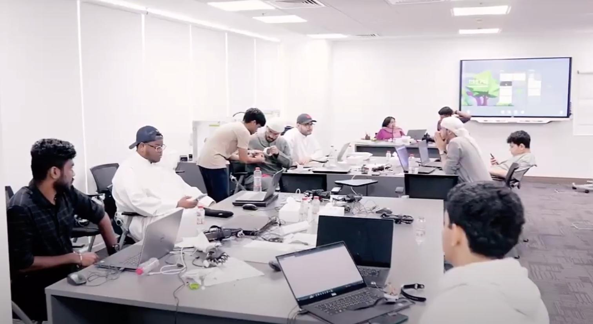

Reflecting on the incredible journey of our 4-day innovation camp organized by Fablab UAE in collaboration with the Hamdan Foundation fills me with immense gratitude and excitement! 🤗.

{/* truncate */}

Originally posted on [Linkedin](https://www.linkedin.com/posts/salmanfarisvp_tinymlabrworkshopabrseries-innovationcamp-activity-7179346137559019521--prl?utm_source=share&utm_medium=member_desktop).

<iframe width="700" height="400" src="https://www.youtube.com/embed/GMfOwcv4Jc8?si=Zgft1qfrMVWy7t_2" title="YouTube video player" frameborder="0" allow="accelerometer; autoplay; clipboard-write; encrypted-media; gyroscope; picture-in-picture; web-share" referrerpolicy="strict-origin-when-cross-origin" allowfullscreen></iframe>

#TinyML_Workshop_Series 🚀 hashtag#InnovationCamp

Reflecting on the incredible journey of our 4-day innovation camp organized by Fablab UAE in collaboration with the Hamdan Foundation fills me with immense gratitude and excitement! 🤗.

Together, we embarked on a thrilling exploration of AI and electronics, igniting creativity and curiosity among participants from the Middle East. From grasping the fundamentals of AI to delving into physical computing with Arduino and Seeed Studio XIAO series, the journey was nothing short of exhilarating.

A heartfelt thank you to everyone involved. Nawal Abdul Kareem, your unique contributions from the medical field enriched our learning experience, inspiring us with your dedication and passion for innovation. Hashim Al Hashmi, Fablab UAE, Hamdan Foundation, your unwavering support and belief in our vision have laid the foundation for countless success stories. Alison Yang from Seeed Studio, your generous provision of resources empowered us to turn ideas into reality, propelling innovation to new heights. MakerGram, thank you for being part of our journey and supporting our endeavours.

And a special shoutout to the amazing projects developed during the camp:

🌟 Dreamy Spark 👶: A baby monitoring system powered by tinyML, capable of detecting when a baby is crying by using the Seeed XIAO ESP32-S3 onboard microphone and sending notifications to your phone.

🌟 Human Fall Detection and Alert 🚨: By utilizing continuous motion monitoring using Seeed XIAO nRF52850 Sense onboard IMU, this project detects when a person falls and sends immediate notifications for assistance.

🌟 Sign Language Translator 🪧: Using tinyML and XIAO ESP32-S3 camera, this project translates sign language gestures and displays the translation on an attached display, fostering inclusivity and accessibility.

🌟 Alertify 🚗: A vehicle health monitoring system that alerts users in case of accidents or emergencies using Seeed XIAO nRF52840 Sense IMU, ensuring safety on the road.

To all the participants, mentors, and supporters, your enthusiasm and dedication have made this journey unforgettable. Let's continue pushing the boundaries of innovation and creating a brighter future together! 🎉

Video courtesy Fablab UAE, Hamdan Foundation.