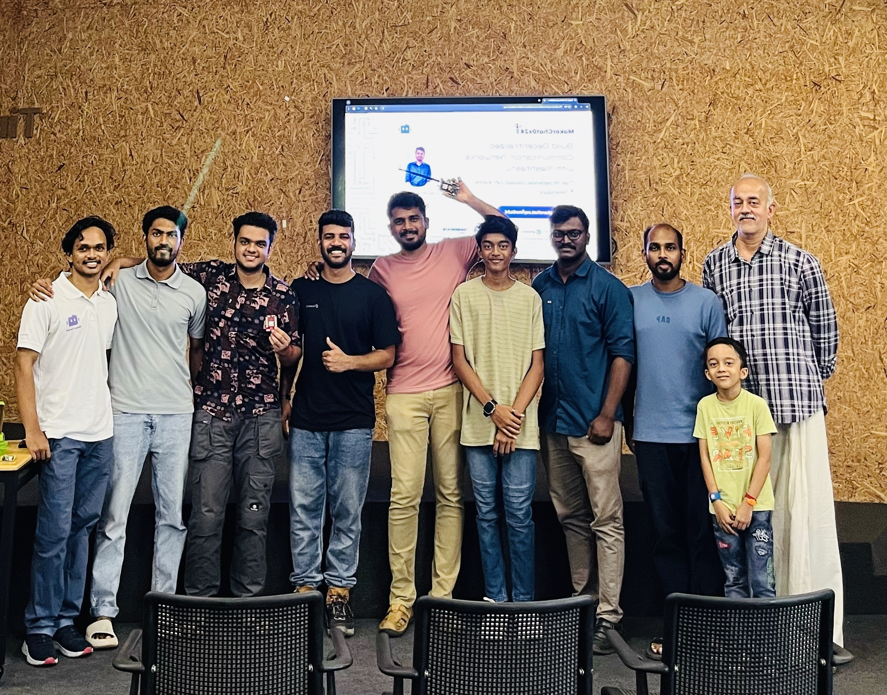
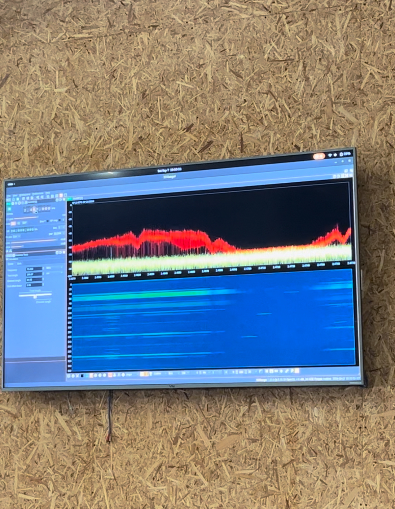
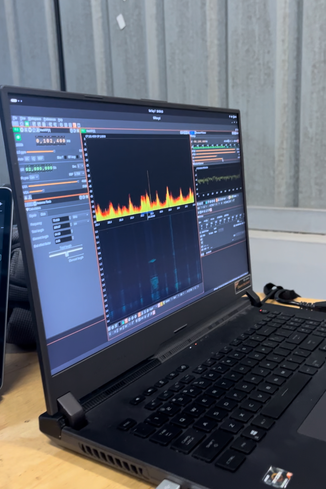
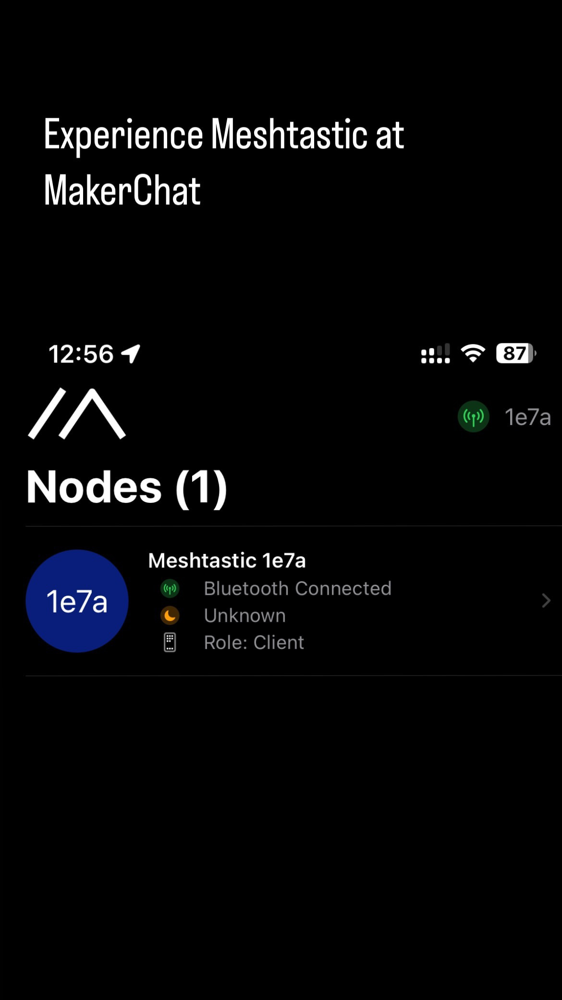
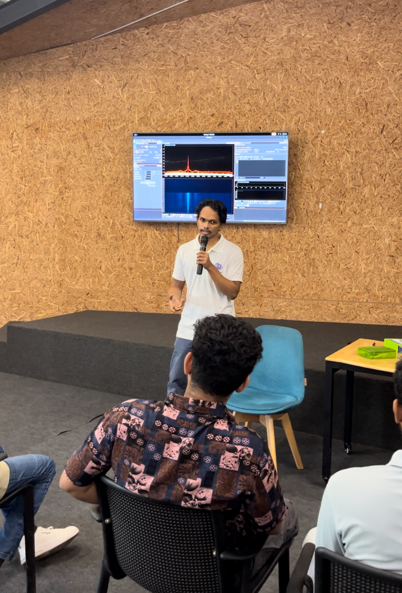
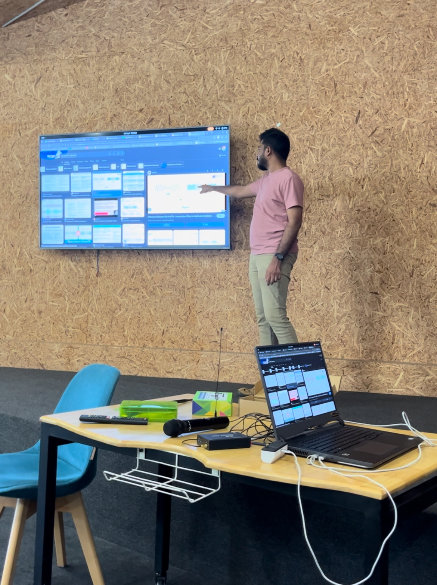
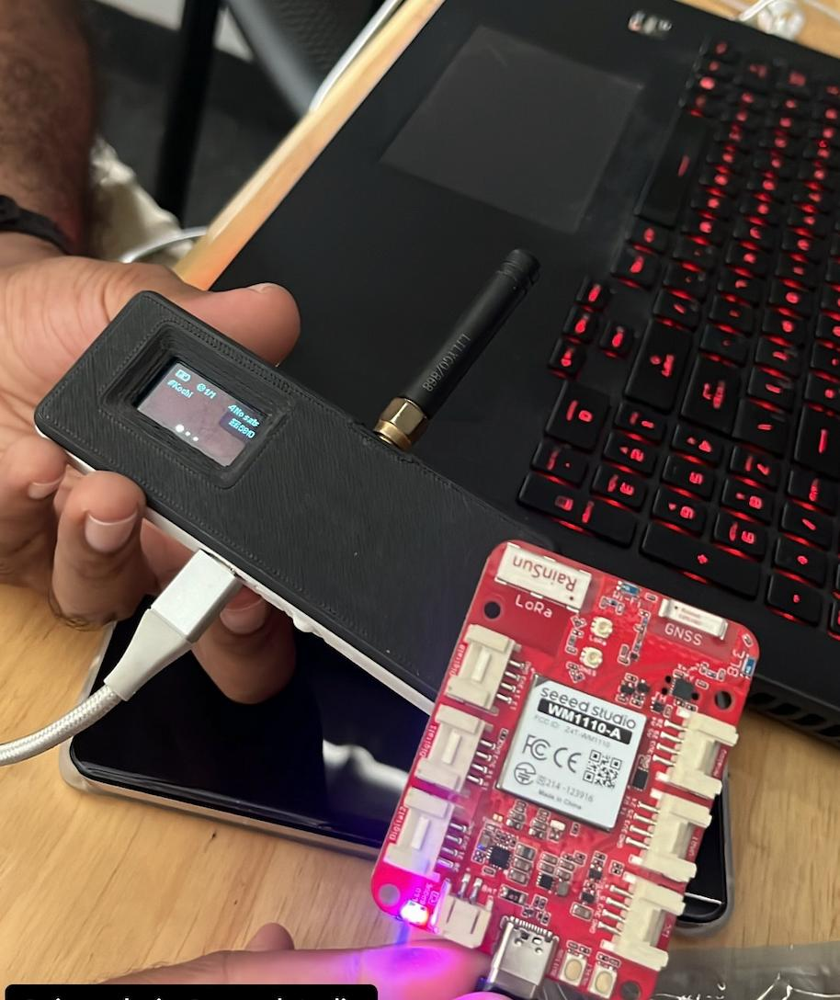

_MakerChat0x24 Team Photo_

This month, the topic was “Build a Decentralised Communication Network with Meshtastic ”, and our speaker was the CEO of MeviTech and my friend Vignesh Naduvathuparambil. I met him at a hackathon, and I knew he is a passionate maker and hacker; he is one of the people I know who has ‘cool’ RF Tools 📡.

{/* truncate */}

_SDR Demo_

SDR Demo with Wireless Mic.

_SDR Test_

Day before the event, for the demo I setup an node with [SeeedStudio Wio Tracker W1100](hhttps://www.seeedstudio.com/Wio-Tracker-1110-Dev-Kit-for-Meshtastic.html) by following their ([documenation]https://wiki.seeedstudio.com/meshtastic_kit_wio_tracker_1110/) and it was so stright forward and easy.

<video src="https://github.com/salmanfarisvp/salmanfarisvp.github.io/raw/main/assets/2024-09-14-makerchat0x4-post-event/Node1.mp4" width="320" height="240" controls>
</video>

_Node Setup with SeeedStudio Wio Tracker_

_Meshtastic Mobile App_

MakerChat began with an introduction by Abhay P A, followed by an overview of the speaker and topic.

_Abhay Introducing MakerGram and TinkerSpace_

Vignesh Naduvathuparambil started the talk with basic RF terminology and how it works, like FM and AM. Then, he dived into the chirp spread spectrum used in LoRa, how it carries data and its advantages. Since he has HackRF SDR (Software Defined Radio), we can see some of the Modulation and real-time RF signal in the waterfall plot.

_Vignesh Talking about RF_

Then, after the theoretical session, I joined Vignesh to demo the Meshtastic network with the Llygo Go node and Seeed Studio Node. We showcased how they communicate in the real world and introduced the required hardware and application. We encountered some issues with message reception on one node, but we could show the capability. Maybe these nodes are the first in Kochi or Kerala (I'm not sure).

_Seeed and LilyGo Nodes_

After the insightful session, we tinkered around with the M5Stack Card computer and FliperZero to showcase some basic attacks and fun experiences on RF networks 😁. We also played with SDR for a while and received FM radio station programs with good audio quality.

<video src="https://github.com/salmanfarisvp/salmanfarisvp.github.io/raw/main/assets/2024-09-14-makerchat0x4-post-event/FMviaSDR.mp4" width="320" height="240" controls>
</video>

_Playing FM via SDR_

It was a fantastic MakerChat filled with information. Thanks, TinkerHub for the Venue, Seeed Studio for the node, Abhay P A and MUHAMMAD SWALAH for coordination and Vignesh Naduvathuparambil for the session 👌.
