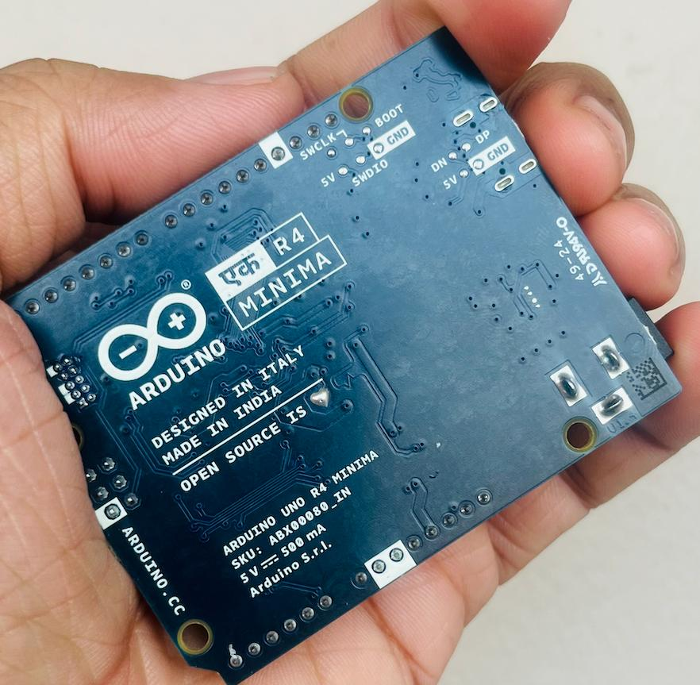

_ആർഡ്വിനോ ഏക് (EK/ एक)_

# ആർഡുയിനോ എന്താണ്?

ഇലക്ട്രോണിക്സ് പഠിക്കുകയോ, പ്രോട്ടോടൈപ്പിങ് പ്രോജക്റ്റുകൾ ചെയ്യുകയോ ചെയ്യുന്നവർക്കായി രൂപകല്പന ചെയ്ത ഒരു ഡെവലപ്‌മെന്റ് പ്ലാറ്റ്ഫോമാണ് Arduino. വളരെ ലളിതമായി ഇലക്ട്രോണിക്സ് പഠിക്കാനും പരീക്ഷിക്കാനും ഈ പ്ലാറ്റ്ഫോം സഹായിക്കുന്നു. ഇറ്റലിയിലെ IDII (Interaction Design Institute Ivrea) ലെ വിദ്യാർത്ഥികൾക്ക് ഇലക്ട്രോണിക്സ് പഠിപ്പിക്കാനായി ആരംഭിച്ച "Wiring" എന്ന പ്രൊജക്റ്റിന്റെ അടിസ്ഥാനത്തിൽ ആണിത് വികസിപ്പിച്ചെടുത്തത്.

{/* truncate */}

ഇന്ന് ആഗോളതലത്തിൽ Embedded Systems പ്രോട്ടോടൈപ്പിങ് രംഗത്ത് മുൻനിരയിൽ നിൽക്കുന്ന ഒരു ബ്രാൻഡായി ആർഡുയിനോ മാറിയിരിക്കുന്നു. ഇതിന്റെ മറ്റൊരു സവിശേഷത, Software & Hardware രണ്ടും Open Source ആയതിനാൽ, ആരായാലും ആർഡുയിനോ ബോർഡുകൾ നിർമിക്കാം. അവശ്യമായ സർക്യൂട്ട് ഡയഗ്രാമുകളും സോഴ്സ് കോഡുകളും അർഡുയിനോ ഔദ്യോഗികമായി തന്നെ ലഭ്യമാക്കുന്നു.

# ആര്ടിനോ ഇന്ത്യയിൽ

ഇന്നത്തെ സാഹചര്യം നോക്കിയാൽ, ഓറിജിനൽ ആർഡുയിനോ ബോർഡുകൾ ഇന്ത്യയിൽ കുറഞ്ഞത് ₹3,000 മുതൽ തുടങ്ങി വിലയുണ്ട്. അതേസമയം ക്ലോൺ/കോപി ബോർഡുകൾ ₹300 മുതൽ വിപണിയിൽ ലഭ്യമാണ്. സ്കൂൾ/കോളേജ് തലത്തിൽ ലളിതമായ പ്രോജക്റ്റുകൾക്കായി ക്ലോൺ ബോർഡുകൾ ഉപയോഗിക്കുന്നത് വലിയ പ്രശ്നമല്ല, പക്ഷേ കമ്പളെക്സായ പ്രോജക്റ്റുകൾക്കായി അത്യാവശ്യം ഗുണമേന്മയുള്ള ഹാർഡ്വെയർ ആവശ്യമാണ്.

ആർഡുയിനോയുടെ പ്രധാന വരുമാന മാർഗം അഥോരൈസ്ഡ് ബോർഡ് വിൽപ്പനയാണ്, അതിനാൽ കോപ്പി ബോർഡുകളുടെ വ്യാപനം മൂലം ആഗോളതലത്തിൽ ഇന്ത്യയിൽ നിന്ന് ഗണ്യമായ വരുമാനം അവർക്ക് ലഭിക്കുന്നില്ല.
എന്നാൽ, ആർഡുയിനോ സോഫ്റ്റ്‌വെയർ ഉപയോഗിക്കുന്നവരുടെ എണ്ണത്തിൽ ഇന്ത്യ ഒന്നാമത് നിൽക്കുന്നു. ഇത് ആർക്കൈതമെ ഇന്ത്യ വലിയ മാർക്കറ്റാണ് എന്ന് കാണിക്കുന്നു. ഈ സാഹചര്യത്തിലാണ് 2025 ജനുവരി 26-ന് ആർഡുയിനോ EK പുറത്തിറക്കിയത്.

ഇന്ത്യയിലൊരു ആർഡുയിനോ ഫാക്ടറി!
ഡെൽഹിയിൽ ഒരു Arduino Factory തുടങ്ങാൻ ആർക്കൈതമേം ആലോചിച്ചിട്ടുണ്ടെന്ന് അവർ നേരിട്ട് അറിയിച്ചു. കഴിഞ്ഞ ആഴ്ച Arduino India ടീമിനൊപ്പം കൂടിയപ്പോൾ, അവർ ഞങ്ങളുടെ കമ്മ്യൂണിറ്റിക്ക് വേണ്ടി പുതിയ Arduino EK ടെസ്റ്റ് ചെയ്യാനും അനുവദിച്ചു. (Thanks to Deepu S Nath)

ഈ ഫാക്ടറി ആരംഭിച്ചാൽ ഓറിജിനൽ ആർഡുയിനോ ബോർഡുകൾ ₹800 രൂപയ്ക്കുള്ളിൽ തന്നെ ലഭ്യമാകും, കൂടാതെ ഇന്ത്യയിൽ കൂടുതൽ ജോലിഅവസരങ്ങൾ ഉണ്ടാകുകയും ചെയ്യും. STEM വിദ്യാഭ്യാസ രംഗത്തും ഇത് വലിയ മാറ്റങ്ങൾ കൊണ്ടുവരും.

ആർഡുയിനോ ഡേ - 2025 ഈ ഞായറാഴ്ച (16 മാർച്ച് 2025), TinkerHub & MakerGram സംയുക്തമായി TinkerSpace-ൽ Arduino Day 2025 ആഘോഷിക്കുന്നു.
ലോകമെമ്പാടും നടക്കുന്ന Arduino Day പരിപാടിയുടെ ഭാഗമായാണ് നമ്മളും ഈ പരിപാടി സംഘടിപ്പിക്കുന്നത്.

 🚀 പ്രോഗ്രാമിൽ നിങ്ങൾക്ക്: Arduino അടിസ്ഥാനങ്ങൾ മനസ്സിലാക്കാൻ സെഷനുകൾ , Arduino EK (EK/एक) നേരിൽ പരീക്ഷിക്കാൻ അവസരം, ഫ്രീ എൻട്രി – സൌജന്യ പരിപാടി! ഇതിനായി ഏവരെയും ക്ഷണിക്കുന്നു! 🔥.

originally posted on [facebook](https://www.facebook.com/share/p/1FCCTFsFa5/).
Modfied malaylam text with help of Swalah Amani.