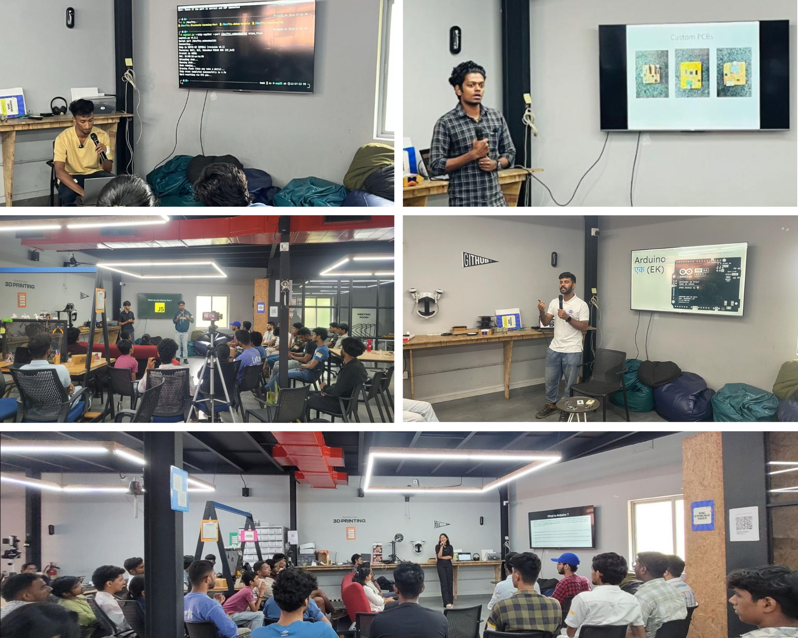

# Arduino Day 2025 at Kochi, India 🇮🇳.

📍In the past, we have organized and celebrated a couple of Arduino Days. However, this year was particularly special because we focused on Arduino Ek, which features the Arduino R4 and R4 Wi-Fi boards made in India. Together with MakerGram and TinkerSpace Kochi, we organized ArduinoDay2025 in Kochi.

{/* truncate */}

It was a short event planned due to the official approval of ArduinoDay, but we were able to pull off a wonderful gathering with the fantastic people we have here.

✨ When planning the event, we aimed to have a few interesting topics and project showcases. However, it has been challenging to secure speakers, especially for hardware-related subjects. To address this, we shared information about the event during our Maker Thursday gatherings, where we meet at TinkerSpace Kochi every Thursday to discuss various making activities. We also mentioned the difficulty in finding speakers, and as a result, some of our members volunteered to conduct sessions themselves.

👏 We would like to extend our gratitude to our amazing speakers. Thank you to Joanne Alice Thomas for the "Introduction to Hardware,"

Abdul Samad M J and MIDLAJ C for the "Programming Arduino with JavaScript,"

Midhun Joseph from Fablab Kerala for discussing "Why We Design Custom PCBs Instead of Using Development Boards,"

Akhil Sam Varghese for his session on "MicroPython on ESP32." Your contributions made for an insightful and engaging event!

We also thank Muhammed Azhar SM for sharing the inspiring story of Autobonics Pvt Ltd and how he started from working with Arduino to building a successful robotics startup.

I shared information about the new Arduino, its history, and why it is relevant, including an introduction to the EK series. I explained its features and discussed its significance for the Indian 🇮🇳 maker ecosystem.

🤗 Thank you to everyone who joined us! A special thanks to the Tinkerspace team, especially Jasim Cm for the overall coordination, Arundhathi Krishna for kickstarting the event, and Johnson Regi , Reema Shaji , Kurian Jacob and their team for their support in coordination. I’d also like to thank Nandana V S for the event poster designs and the MakerGram team, particularly MUHAMMAD SWALAH, for their assistance and for driving late to rent the microphone 🚙.

The event was great; I felt so happy to see many passionate people gather and learn about making things 🤗.

