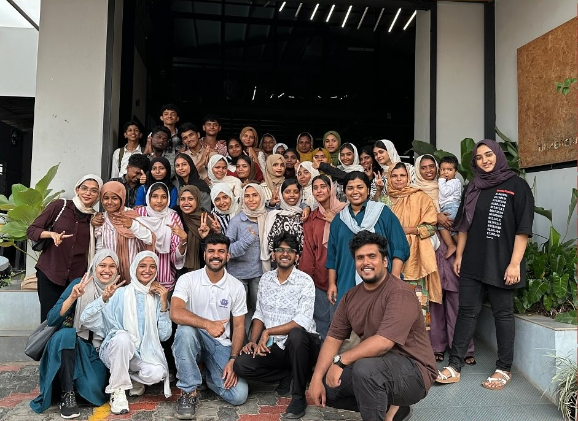
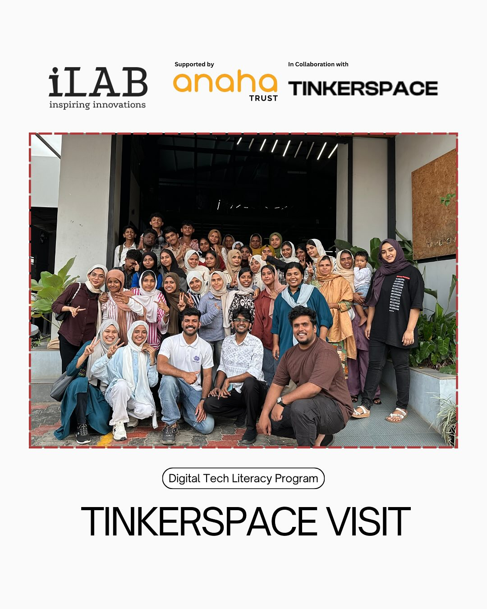
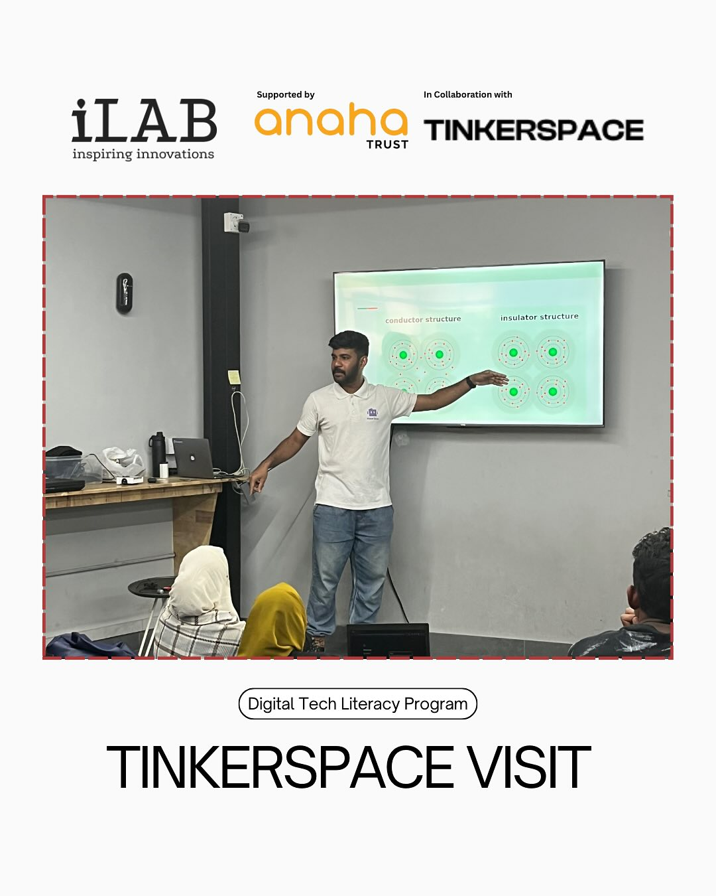
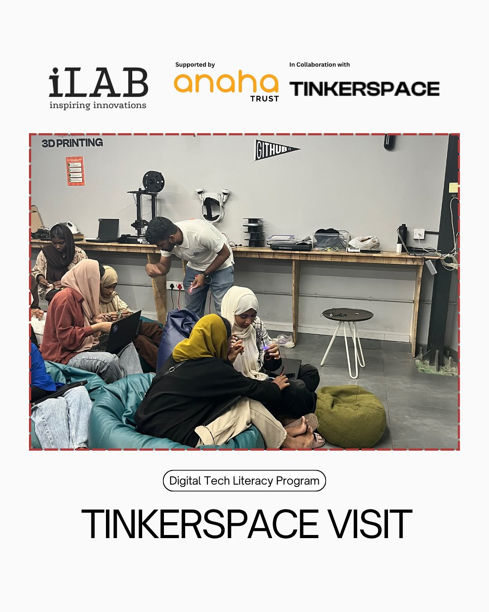
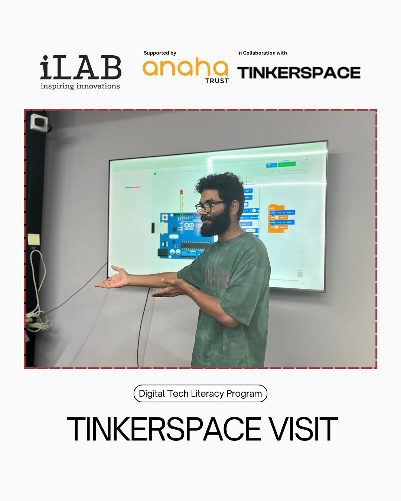
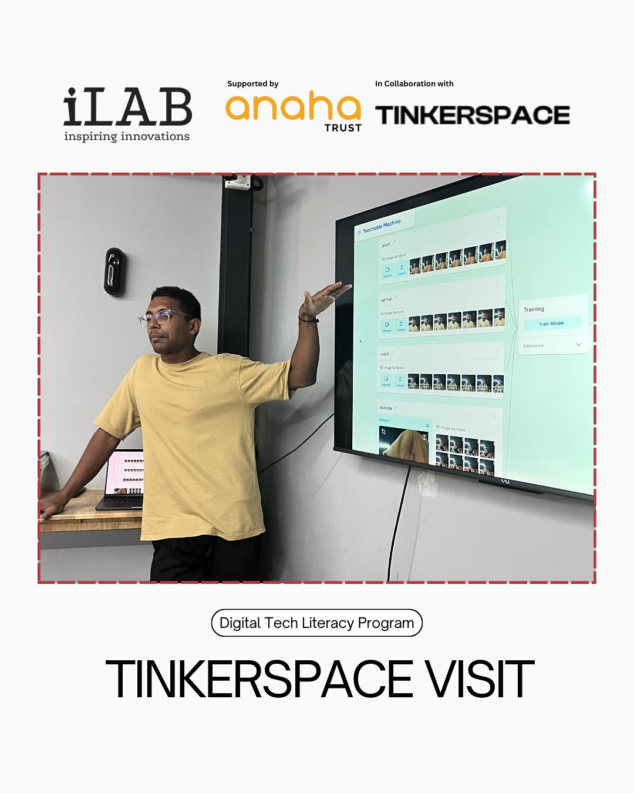
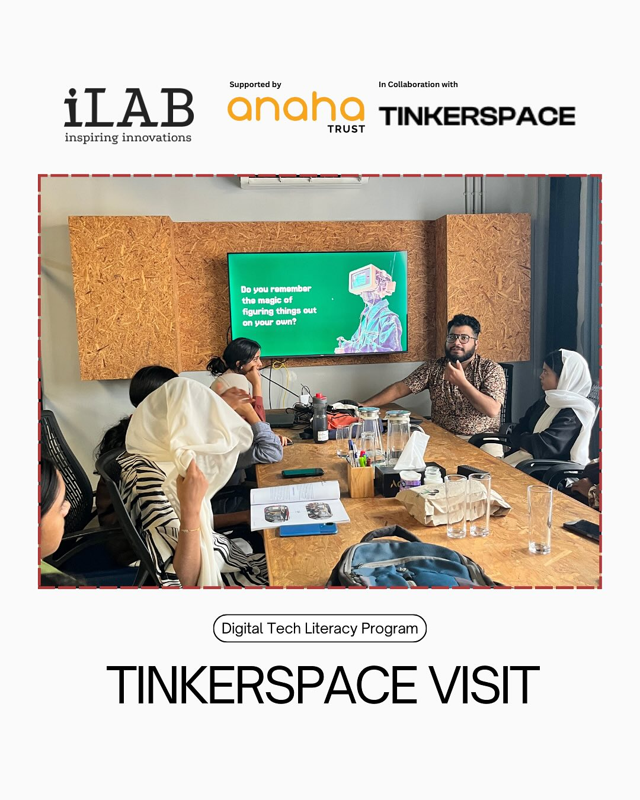

This Saturday, I enjoyed spending time with the iLAB-Innovation Laboratory Digital Literacy members, mostly kids, at TinkerSpace Kochi, introducing them to the world of electronics and the joy of making, along with Nadec Biju and Adarsh N.

{/* truncate */}

_Group Photo_

Instead of jumping straight into Arduino, we started from the basics—lighting up an LED 💡. We explored how it works from the atomic level, relating it to what they learned about atoms and electrons in school. From there, we spun a mini-motor ❋ with some paper attached, sparking excitement as simple components came to life.

Two kids were joined by their parents, who were equally curious and excited. So, we handed out batteries, LEDS, and motors for them to experiment with too— it's so happy to see them also enjoying and lighting an LED 😄.

Later, we gave the students a task: blink an LED manually by disconnecting and reconnecting the battery 🔋. After trying it a few times, I asked them to do it 1000 times. That's when the spark hit—they understood the why behind automation and how technology helps us make life easier. Then Nadec Biju shared about Arduino in Tinkercad Education simulation and block programming, and gave tasks like changing LED blinking frequency, etc.

These sessions aren't about turning kids into electronics wizards overnight. That's not our goal. Our mission is to ignite curiosity and help them realise they can do this too. And more importantly, there's a whole community ready to support their journey.

We also have an Introduction to AI session by Alosh Denny 🙌 - where the students learn about AI, and how it's working under the hood, and they made their first AI model with Google Teachable Machine tool, Kudos to Alosh! .

And then we had our Design session by Niyas V 👏 where he talked about the importance of design, UI and UX of things and introduced us to the tools. Unfortunately, Lazim Aslam can't join due to fever, but he supported Remolty in planning and everything 🤗.

I also got an opportunity to show LED and mini-motor to a 1 year old baby.

<iframe
  src="https://www.instagram.com/reel/DIs0dbupexV/embed"
  width="400"
  height="480"
  frameborder="0"
  scrolling="no"
  allowtransparency="true">
</iframe>

----
Thanks, TinkerSpace Kochi team, Jasim Cm, Reema Shaji and Eldho Sabu for managing everything and the support. And iLAB-Innovation Laboratory team, Nasmina Nasir, Kadeeja Fidha and all the volunteers and participants and finally, the team MakerGram and Nawal Abdul Kareem for the support as always 🤗.

Let's keep sparking minds, one LED at a time. 💡💜

------

Event Social media posts.
- [iLAB Linkedin Post](https://www.linkedin.com/feed/update/urn:li:activity:7319390860511432706/)
- [Salman Linkedin Post](https://www.linkedin.com/feed/update/urn:li:activity:7319985784407609344/)

