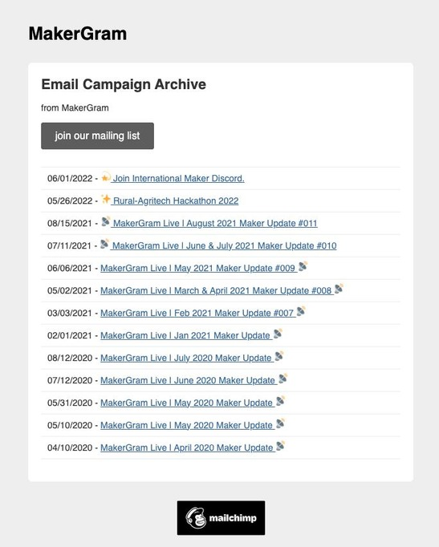

_MakerGram Live Newsletter_

## A Fresh Restart to Our MakerGram Newsletter

{/* truncate */}

As passionate makers and electronics enthusiasts, we’ve been fortunate to receive countless opportunities over the years , thanks to the support of the people and communities around us. We've always wanted to give back in a meaningful way.

One question we often hear from fellow makers is: **“Where can I find upcoming events, contests, or opportunities?”** The truth is, this information is often scattered across the internet. That’s what inspired us to create Solder Junction, a single place to bring it all together and keep our community informed, inspired, and connected.

## A New Beginning

Between October 2020 and January 2022, [we published 13 issues of our community newsletter, MakerGram Live](http://web.archive.org/web/20220930021053/https://us19.campaign-archive.com/home/?u=c46723a04a3a8e6fa328d1ddd&id=b9308c5cc6), filled with events, project updates, and opportunities for makers. But over time, as things got busy, we had to pause. Unfortunately, due to the long period of inactivity, we lost all the content from that previous newsletter a sad outcome, but also a valuable lesson.

So today, we’re making a fresh start with a new name, new platform, and renewed purpose.

## Introducing Solder Junction 🔌✨

This is our new community newsletter, built on Substack, designed to be open, accessible, and easier to maintain long-term.

👇 Read the first issue here

#1 🚀 Welcome to "Solder Junction" : News, Builds, and Everything Makers Love by MakerGram

Issue 01 - June:July 2025 
<a data-post-link href="https://makergram.substack.com/p/1-welcome-to-solder-junction-news">Read on Substack</a>

We’re bringing back everything that made the original newsletter special and updated it with the latest happenings in the maker community.

I wanted to share this with you, and I hope you find it useful. By MakerGram team for the community.